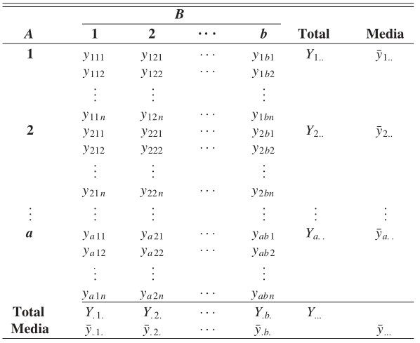

<style type="text/css">
body, td {
   font-size: 14px;
}
code.r{
  font-size: 20px;
}
pre {
  font-size: 18px
}
.col2 {
    columns: 2 200px;         /* number of columns and width in pixels*/
    -webkit-columns: 2 200px; /* chrome, safari */
    -moz-columns: 2 200px;    /* firefox */
  }
  .col3 {
    columns: 3 100px;
    -webkit-columns: 3 100px;
    -moz-columns: 3 100px;
  }
</style>
```{r include=FALSE}
knitr::opts_chunk$set(comment=NA, echo=FALSE)

```
```{r setup, include=FALSE}
library(icon)
```
```{r include="FALSE" }

library(ggplot2)
library(ggpubr)
library(tidyverse)
library(broom)
library(AICcmodavg)
library(car) ##LaveneTest
## Cargar datos
dataSet<-read.csv("crop.data.csv",TRUE, ",",colClasses = c("factor","factor","factor","numeric"))
## Renombrar columnas
dataSet <- rename(dataSet, densidad="density", fertilizante="fertilizer", bloque="block", desempeño="yield")
dataSet <- select(dataSet, c(densidad, fertilizante, desempeño))
a.dosfact <- aov(desempeño ~ fertilizante * densidad, data = dataSet)
```


## Introducción

ANOVA: Análisis de varianza. 

Permite estudiar el efecto de dos variables llamadas factores (con sus respectivos niveles) sobra  una variable de cuantitativa (continua).

Por ejemplo: 

- Determinar el efecto sobre la motivación en el trabajo de la edad y el género.
- Efecto del tiempo (lento, medio, rapido) y temperatura (baja, media, alta) sobre una reacción química.

## Ventajas

- Estudia el efecto de **dos factores** en la variable de decision y el efecto de la **interacción entre ellas**. 

- Reduce la variabilidad del error. 

- Puede probar la independencia de los factores (siempre que haya mas de una observación por celda). 

- Reduce el cálculo, ya que incluye varios ANOVA de un factor. 

## Modelo 

### Supuestos del modelo

1. Las poblaciones desde donde se toman las muestras se distribuyen normalmente. 
2. Las muestras son independientes. 
3. La varianza de las poblaciones debe ser igual (homocedasticidad)
4. El tamaño de muestra debe ser igual en cada celda. 


## Modelo formal

<div class="centered">
```{r, out.width = "500px", fig.align='center'}

```

<font size="2">
**Probabilidad y estadística para ingeniería y ciencias**. Ronald E. Walpole, R. H. Myers, S. L. Myers, K. Ye, 9na ED, PEARSONS EDUCACIÓN, México, 2012. p. 565
</font>
</div>


## Modelo formal - simbología

Se definen los siguientes símbolos: 

<font size="4">

$Y_{ij} =suma\ de\ las\ observaciones\ en\ la\ (ij)-ésima\ celda,$

$Y_{i..} =suma\ de\ las\ observaciones\ para\ el\ i-ésimo\ nivel\ factor\ A,$

$Y_{.j.} =suma\ de\ las\ observaciones\ para\ el\ j-ésimo\ nivel\ factor\ B,$

$Y_{...} = suma\ de\ las\ a*b*n\ observaciones,$

$\bar{y}_{ij} = media\ de\ las\ observaciones\ en\ la\ (ij)-ésima\ celda,$

$\bar{y}_{i..} = media\ de\ las\ observaciones\ para\ el\ i-ésimo\ nivel\ factor\ A,$

$\bar{y}_{.j.} = media\ de\ las\ observaciones\ para\ el\ j-ésimo\ nivel\ factor\ B,$

$\bar{y}_{...} = media\ de\ todas\ las\ a*b*n\ observaciones.$
</font>

## Modelo - continuación

Podemos escribir cada observación de la tabla como: 
$$y_{ijk} = \mu_{ij} + \epsilon_{ijk} \ (1)$$
<font size="3">
$\epsilon_{ijk}$: desviaciones de los valores de $y_{ijk}$ observados en la $(ji)$-$ésima$ celda respecto de la media de la población $\mu_{ij}.$
</font>

Si consideramos  $\mu_{ij}$ como:
$$\mu_{ij}=\mu+\alpha_{i}+\beta_{j}+(\alpha\beta)_{ij} \ (2)$$
(2) en (1): 
$$y_{ijk}=\mu+\alpha_{i}+\beta_{j}+(\alpha\beta)_{ij}+\epsilon_{ijk},$$
<font size="2">
$$\sum_{i=1}^a\alpha_{i}=0,\ \ \sum_{j=1}^b\beta_{j}=0,\ \ \sum_{i=1}^a (\alpha\beta)_{ij}=0,\ \ \sum_{j=1}^b (\alpha\beta)_{ij}=0.$$
</font>

## Hipótesis del modelo
<ol>
<li><p>
$H_{0}':\ \alpha_{1} = \alpha_{2} = \dots = \alpha_{a} = 0$,<br>
$H_{1}': Al\ menos\ una\ de\ las\ \alpha_{i}\ no\ es\ igual\ a\ 0.$</p>
</li>
<li><p>
$H_{0}'':\ \beta_{1} = \beta_{2} = \dots = \beta_{b} = 0$,<br>
$H_{1}'': Al\ menos\ una\ de\ las\ \beta_{i}\ no\ es\ igual\ a\ 0.$</p>
</li>
<li><p>
$H_{0}''':\ \alpha\beta_{11} = \alpha\beta_{12} = \dots = \alpha\beta_{ab} = 0$,<br>
$H_{1}''': Al\ menos\ una\ de\ las\ (\alpha\beta)_{ij}\ no\ es\ igual\ a\ 0.$</p>
</li>  
<br>
Las pruebas de hipótesis anteriores se basarán en la comparación de estimados independientes de $\sigma^{2}$, obtenidos al separar la suma de cuadrados total de los datos en cuatro componentes.

## Recordatorio: Identidad de la suma de cuadrados. 
<font size="2">
$$\sum_{i=1}^a{\sum_{j=1}^b{\sum_{k=1}^n}} (y_{ijk}-\bar{y}_{\dots})^2 = bn\sum_{i=1}^a (\bar{y}_{i..} - \bar{y}_{\dots})^2 + an\sum_{j=1}^b (\bar{y}_{.j.} - \bar{y}_{\dots})^2 + n\sum_{i=1}^a{\sum_{j=1}^b}{(\bar{y}_{ij.} -\bar{y}_{i..} - \bar{y}_{.j.} + \bar{y}_{\dots})^2} + \sum_{i=1}^a{\sum_{j=1}^b{\sum_{k=1}^n}} {(y_{ijk}-\bar{y}_{ij})^2}$$
</font>

Lo anterior podemos expresarlo simbólicamente como: 
$$SCT = SCA + SCB + SC(AB) + SCE$$
Grados de libertad 
$$abn -1 = (a-1) + (b-1) + (a-1)(b-1)+ab(n-1)$$

## Estadísticos 
<font size="3">
$$\hat{S}_{1}^{2}=\frac{SCA}{a-1},\ \ \ \hat{S}_{2}^{2}=\frac{SCB}{b-1},\ \ \ \hat{S}_{3}^{2}=\frac{SC(AB)}{(a-1)(b-1)},\ \ \ \hat{S}^{2}=\frac{SCE}{ab(n-1)}$$


Todos estos estimadores de la varianza son estimados independiendes de $\sigma^{2}$, siempre que no haya efectos $\alpha_{i}$, $\beta{j}$ ni, por supuesto, $(\alpha\beta)_{ij}$. Si las sumas de los cuadrados se interpretan como funciones de las variables aleatorias independientes $y_{111}, y{112},\dots,y_{abn}$, no es difícil comprobar que: 

$$E(\hat{S}_{1}^{2})=E[\frac{SCA}{a-1}] = \sigma^2 +\frac{nb}{a-1}\sum_{i=1}^a\alpha_{i}^{2},$$
  
$$E(\hat{S}_{2}^{2})=E[\frac{SCB}{b-1}] = \sigma^2 +\frac{na}{b-1}\sum_{j=1}^a\beta_{j}^{2},$$
  
$$E(\hat{S}_{3}^{2})=E[\frac{SC(AB)}{(a-1)(b-1)}] = \sigma^2 + \frac{n}{(a-1)(b-1)} \sum_{i=1}^a{\sum_{j=1}^b}{(\alpha\beta)_{ij}},$$
$$E[\hat{S}^{2}]=E[\frac{SCE}{ab(n-1)}] = \sigma^2$$

De lo anterior se observa que los cuatro estimadores son **no sesgados** cuando $H_{0}', H_{0}'' y H_{0}'''$ son verdaderas.
</font>

## Comprobación de hipótesis nula
<font size="3">
**Prueba F para Factor A:**

$f_{1}=\frac{\hat{S}_{1}^{2}}{\hat{S}^{2}}, F_{1}$~$F_{((a-1),(ab(n-1))}\  cuando\ H_{0}'\ es\ verdadera$.

Se rechaza $H_{0}'$ al nivel de significancia $\alpha$ cuando $f_{1} > f_{\alpha}[a-1,ab(n-1)]$.

**Prueba F para Factor B**

$f_{2}=\frac{\hat{S}_{2}^{2}}{\hat{S}^{2}}, F_{2}$~$F_{((b-1),(ab(n-1))} cuando\ H_{0}''\ es\ verdadera$.

Se rechaza $H_{0}''$ al nivel de significancia $\alpha$ cuando $f_{2} > f_{\alpha}[b-1,ab(n-1)]$.

**Prueba F para interacción**

$f_{3}=\frac{\hat{S}_{3}^{2}}{\hat{S}^{2}}, F_{3}$~$F_{((a-1)(b-1),(ab(n-1))}\ cuando\ H_{0}'''\ es\ verdadera.$

Se rechaza $H_{0}'''$ al nivel de significancia $\alpha$ cuando $f_{3} > f_{\alpha}[(a-1)(b-1),ab(n-1)]$.
</font>

## Análisis Post-Hoc

Anova nos permite determinar si es significativo el aporte a la varianza de alguno de los factores como efectos principales o la interacción, sin embargo, para saber cuál es la fuente de variabilidad se puede usar un test como Turkey HSD o t-test.

Además, es recomendable estudiar la interacción y posteriormente cada factor por separado. 


## Aplicación

<div class="row centered">
<div class="col2">
### Muestra de datos
```{r }
## Muestra de las observaciones
dataSet[1:20,]
```
### Resumen de datos

```{r }
## Resumen de datos
summary(dataSet)
```
</div>
</div>

## Aplicación

**Comprobar normalidad**
<div class="row centered">
<div class="col2">
```{r fig.width=4, fig.height=3}
hist(dataSet$desempeño, main="Histograma variable desempeño", ylab = "Frecuencia", xlab = "Desempeño")
```

```{r }
shapiro.test(dataSet$desempeño)
```
</div>
</div>

<font size="3">
Histograma presenta una forma similar a distribución normal. Por otro lado, Shapiro Test respecto a la normalidad de los datos es no significativo a un nivel de $\alpha = 0.05$ (valor-p = 0.6135).
</font>

## Aplicación
**Homogeneidad de varianzas**
<div class="row centered">
```{r fig.width=8, fig.height=4}
par(mfrow=c(1,2))
plot(a.dosfact,c(1,2))
par(mfrow=c(1,1))
```
</div>
<font size="3">
A partir del análisis visual podemos determinar que las varianzas dentro de los grupos es similar. QQPlot muestra gran parte de los datos sobre la línea de "normalidad" con algunos outliers.
</font>

## Aplicación

### Homogeneidad de varianzas

```{r }
#Bartlett Test para homogeneidad de varianzas
bartlett.test(desempeño ~ interaction(densidad, fertilizante), data = dataSet)

#LaveneTest
leveneTest(desempeño ~ densidad * fertilizante , data = dataSet)
```

Ambos test arrojan resultados no sgnificativos a un nivel de $\alpha = 0.05$ (valor-p 0.9631 y 0.9768).

## Apliacación 
### Resultados ANOVA
```{r}
summary(a.dosfact)
```

- No hay significancia del efecto de la interacción a un nivel $\alpha = 0.05$ (valor-p = 0.53250)
- Efectos principales fertilizante y densidad presentan alto nivel de significancia.

## Aplicación
### Análisis post-hoc
```{r}
##Test tukey considerando factores principales
##no se presenta resultado sobre interacción puesto que es no significativo
TukeyHSD(a.dosfact, which=c("densidad","fertilizante")) 
```

## Aplicacíón
### Grafico de interacción

```{r }
par(mfrow=c(1,2))
with(data=dataSet, expr ={
  interaction.plot(densidad,fertilizante,response=desempeño)
  interaction.plot(fertilizante,densidad,response=desempeño)
})

```

## Comparación t-Test

**desempeño ~ densidad**

```{r}
pairwise.t.test(dataSet$desempeño, dataSet$densidad)
```

## Comparación t-Test

**desempeño ~ fertilizante**
```{r}
pairwise.t.test(dataSet$desempeño, dataSet$fertilizante)
```

- F-test significativo para densidades (1,2) valor-p<0.01

- F-test significativo para (1,3) y (2,3).

- F-test es no significativo para fertilizantes (1,2) a un valor $\alpha = 0.05$

### Conclusión:

- Efecto principal de densidad mejora el rendimiento.
- Efecto principal fertilizante mejora rendimiento para el caso 3.


## Referencias

- **Data Analysis in Management With SPSS Software**. J.P Verma, Chapter 8, DOI:10.1007/978-81-322-0786-3_8, (C) Springer India 2013
- **Probabilidad y estadística para ingeniería y ciencias**. Ronald E. Walpole, R. H. Myers, S. L. Myers, K. Ye, 9na ED, PEARSONS EDUCACIÓN, México, 2012.  
- **Use R! R by example**. J. Albert, M. Rizzo, SPRINGER at [](DOI 10.1007/978-1-4614-1365-3)
- [ANOVA in R: A step-by-step guide](https://www.scribbr.com/statistics/anova-in-r/)  
- [R documentation](https://www.rdocumentation.org/)
- [Starting at R](https://www.staringatr.com/)

## Licencia


```{r}
icon::fa("github")
```
[jpsaavedraguerin/metodos_cuantitativos](https://github.com/jpsaavedraguerin/metodos_cuantitativos) bajo licencia [MIT](https://github.com/jpsaavedraguerin/metodos_cuantitativos/blob/master/LICENCE)
