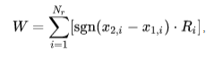
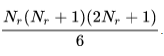
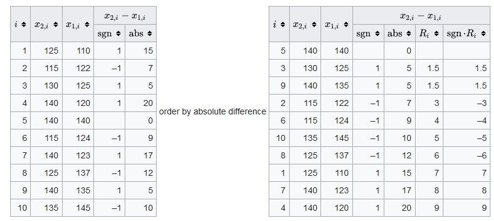
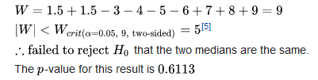

```{r setup, include=FALSE}
knitr::opts_chunk$set(echo = FALSE)
```

## Introducción

<font size="4">
Metodos paramétricos: Suposición normalidad, tamaño de muestra grande. 

Métodos no paramétricos (distribución libre): No se supone un conocimiento de ninguna clase respecto de las distribuciones de las poblaciones subyacentes (continuidad).

- Prueba de signo Permite probar la $H_{0}: \mu = \mu_{0}$ en poblaciones con $n<30$ y no normal.

- Prueba propuesta por Frank Wilcoxon en 1945 amplía la prueba de signo para incluir también la magnitud.

**Desventajas**

* No utilizan toda la información que proporciona la muestra: si se pueden aplicar ambos métodos, no paramétricos reporta menos eficiencia.   

* Requiere un tamaño de muestra mayor que paramétrica.  

* Afecta pruebas t y F.  

</font>


## Prueba de rango (Wilcoxon)

**Supuestos**

- Los datos son pareados y vienen de la misma población.

- Cada par es escogido de forma aleatoria e independiente. 

**Hipótesis**

$H_{0}$: Diferencia entre pares sigue una distribución simétrica alrededor del cero.

$H_{1}$: Diferencia entre pares no sigue una distribución simétrica alrededor del cero.

## Método

Se calcula el estadístico $W$

<div class="row centered">

</div>

Se conoce la esperanza del estimador como: 

<div class="row centered">

</div>

Se concluye el rechazo de la hipótesis nula si: 

<div class="row centered">

</div>

## Tabla test Wilcoxon

<div class="row centered">
```{r, out.width = "600px", fig.align='center'}
knitr::include_graphics("WilcoxonTabla.PNG")
```

<font size="3">
[Real Statistics Using Excel](http://www.real-statistics.com/statistics-tables/wilcoxon-signed-ranks-table/
)
</font>
</div>
## Ejemplo

<div class="row centered">

<br>

</div>

## Referencias

- **Probabilidad y estadística para ingeniería y ciencias**. Ronald E. Walpole, R. H. Myers, S. L. Myers, K. Ye, 9na ED, PEARSONS EDUCACIÓN, México, 2012.  
- [Wikipedia/Wilcoxon_signed-rank_test](https://en.wikipedia.org/wiki/Wilcoxon_signed-rank_test)