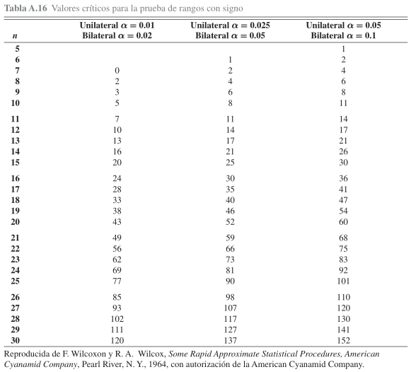

```{r setup, include=FALSE}
knitr::opts_chunk$set(echo = FALSE)
```

## Introducción

<font size="5">
Metodos paramétricos: Supuesto de normalidad y/o tamaño de muestra grande.  $H_{0}: \mu = \mu_{0}$.

Métodos no paramétricos (distribución libre): No se supone un conocimiento de ninguna clase respecto de las distribuciones de las poblaciones subyacentes (probable continuidad). $H_{0}: \tilde{\mu} =\tilde{\mu}_{0}$

- Prueba propuesta por Frank Wilcoxon en 1945 amplía la prueba de signo para incluir también la magnitud.

**Desventajas**

- Si se pueden aplicar ambos métodos, no paramétricos reporta menos eficiencia. 

- Requiere un tamaño de muestra mayor que paramétrica para igual potencia.

</font>

## Prueba de signo

**Media** es reemplazada por **mediana** como **parámetro de ubicación**.

Dada una variable aleatória X, la mediana se define de modo que: 
$$P(X>\tilde{\mu})\leq{0.5}\ y\ P(X<\tilde{\mu})\leq{0.5}$$
$$H_{0}: \tilde{\mu} =\tilde{\mu}_{0}$$

- Signo + : elementos de la muestra que están sobre $\tilde{\mu}_{0}$  
- Signo - : elementos de la muestra que están bajo  $\tilde{\mu}_{0}$  
- Diferencias nulas se eliminan y reduce tamaño de muestra.

Población simétrica:se anulan signos y no rechazamos $H_{0}$

## Prueba en la prueba de signos

Estadistico de prueba: $X : número\ de\ elementos\ con\ signo\ "+"\ en\ la\ muestra$. 

$$X\sim{b(\frac{1}{2})}$$
Rechaza $H_{0}: \tilde{\mu} =\tilde{\mu}_{0}$ en favor de:   
$H_{1}: \tilde{\mu} <\tilde{\mu}_{0}$: Prop. "+" suficientemente $<\frac{1}{2}$ (x pequeño)  
$H_{1}: \tilde{\mu} >\tilde{\mu}_{0}$: Prop. "+" suficientemente $>\frac{1}{2}$ (x grande)  
$H_{1}: \tilde{\mu} =\tilde{\mu}_{0}$:: Prop. "+" o "-" suficientemente menor o mayor que $\frac{1}{2}$ como se requiera.   

## Ejemplo prueba de signos

```{r, out.width = "500px", fig.align='center'}

```

<font size="3">
Valor del estadístico de prueba mayor a nivel de significancia definido. No rechaza $H_{0}$  
También se puede plantear $H_{0}:\tilde{\mu}-\tilde{\mu}_{0}=0$ 
</font>

## Prueba de rango con signo (Wilcoxon)

- Toma en consideración además del signo, la magnitud de las diferencias. 

- Se aplica en el caso de distribucion continua simetrica (no paramétrica).

$$H_{0}: \tilde{\mu} =\tilde{\mu}_{0}$$

## Método
<font size="5">

1. Se resta $\tilde{\mu}_{0}$ de cada valor muestral (descartando diferencias nulas).  
1. Se ordenan las diferencias sin importar el signo.  
1. Se asignan categorías a las diferencias, desde la más pequeña a la mas grande (1,2,3....,n). Se promedian diferencias repetidas.  
1. Se suman los rangos para las diferencias positivas $w_{+}$ y las diferencias negativas $w_{-}$.  
1. Designamos al más pequeño entre $w_{+}$ y $w_{-}$ como $w$. Es decir $w=min[w_{+},w_{-}]$.  

Si la hipotesis $\tilde{\mu} =\tilde{\mu}_{0}$ es verdadera, los rangos que corresponden a las diferencias positivas debería ser casi igual al total de los rangos que corresponden a las diferencias negativas. 

</font>

## Método

Resumen de hipótesis una muestra y en pares.  
  
  

  
```{r, out.width = "300px", fig.align='center'}

```
  
  
Rechazamos $H_{0}$ si $w_{+},w_{-} o w$ es **menor o igual que** valor tabulado.


## Tabla de valores críticos

```{r, out.width = "500px", fig.align='center'}

```


## Ejemplo 

```{r, out.width = "500px", fig.align='center'}

```


## Aproximación normal para muestras grandes


Para $n\geq15$ podemos utilizar: 

$$Z = \frac{W_{+}-\mu_{w_{+}}}{\sigma_{w_{+}}} \sim N (\mu_{w_{+}},\sigma_{w_{+}} )$$ 

para determinar la región crítica para la prueba.

Con: 

$$\mu_{w_{+}}=\frac{n(n+1)}{4}\ \ \ \sigma_{w_{+}}=\frac{n(n+1)(2n+1)}{24}$$

## Prueba de la suma de rangos de Wilcoxon

Objetivo: Probar la igualdad de las medianas de dos distribuciones continuas no normales y cuyas muestras son independientes (no hay emparejamiento). Alternativa a prueba t de dos muestras.

$$H_{0} : \tilde{\mu_{1}} =\tilde{\mu}_{2}$$
Consideramos :
$$n_{1}: número\ de\ observaciones\ de\ la\ muestra\ más\ pequeña$$
$$n_{2}: número\ de\ observaciones\ de\ la\ muestra\ más\ grande$$
Se ordenan las observaciones $n_{1}$ y $n_{2}$ juntando ambas muestras.

## Continuación método

<font size="5">
Además: 
$$w_{1} = suma\ de\ rangos\ de\ n_{1}$$
$$w_{2} = suma\ de\ rangos\ de\ n_{2}$$
El total $w_{1} +w_{2}$ depende sólo del número de observaciones en las dos muestras. 

La expresión: 
$$w_{1} + w_{2}= \frac{(n_{1}+n_{2})(n_{1}+n_{2}+1)}{2}$$
corresponde a la suma arimetica de los enteros 1,2,3, $\dots$,$n_{1}+n_{2}$. 

$w_{1}\ y\ w_{2}$ son valores de las variables aleatorias $W_{1}\ y\ W_{2}$, respectivamente. 
</font>

## Tabla resumen

En general, 

|$H_{0}$|$H_{1}$|$w_{1}$|$w_{2}$|Conclusión|
|:-----:|:-----:|:-----:|:-----:|:--------:|
|$\tilde{\mu_{1}} =\tilde{\mu}_{2}$|$\tilde{\mu_{1}} \neq\tilde{\mu}_{2}$|pequeña|pequeña|rechazar $H_{0}$| 
|$\tilde{\mu_{1}} =\tilde{\mu}_{2}$|$\tilde{\mu_{1}} <\tilde{\mu}_{2}$|pequeña|grande|rechazar $H_{0}$|
|$\tilde{\mu_{1}} =\tilde{\mu}_{2}$|$\tilde{\mu_{1}} >\tilde{\mu}_{2}$|grande|pequeña|rechazar $H_{0}$| 


## Estadístico $U$

Definimos $u_{1} = w_{1} - \frac{n_{1}(n_{1}+1)}{2}$ o $u_{2} = w_{2} - \frac{n_{2}(n_{2}+1)}{2}$ del estadístico relacionado $U_{1}$ o $U_{2}$, o en el valor de $u=min[u_{1},u_{2}]$ del estadístico $U$.

$U_{1}$ y $U_{2}$ tienen distribuciones muestrales simétricas y toman valores en el intervalo de $0$ a $n_{1} \times n_{2}$, tales que $u_{1}+u_{2} =n_{1}\times n{2}$

*$u_{1}$ será pequeña cuando $w_{1}$ sea pequeña, y $u_{2}$ será pequeña cuando $w_{2}$ sea pequeña. Se rechaza $H_{0}$ siempre que los estadísticos apropiados $U_{1},U_{2}$, o $U$ tomen un valor menor o igual que el calor crítico dado en la tabla*

## Tabla resumen hipótesis para estadístico $U$


|$H_{0}$|$H_{1}$|Calcular|
|:-----:|:-----:|:------:|
|$\tilde{\mu_{1}} =\tilde{\mu}_{2}$|$\tilde{\mu_{1}} \neq\tilde{\mu}_{2}$|$u$| 
|$\tilde{\mu_{1}} =\tilde{\mu}_{2}$|$\tilde{\mu_{1}} <\tilde{\mu}_{2}$|$u_{1}$|
|$\tilde{\mu_{1}} =\tilde{\mu}_{2}$|$\tilde{\mu_{1}} >\tilde{\mu}_{2}$|$u_{2}$|


Si el valor de $u_{1}, u_{2}\ o\ u$ es menor o igual que el valor crítico, se rechaza la hipótesis nula al nivel de significancia que se indica en la tabla. 

## Tabla valores críticos

```{r, out.width = "600px", fig.align='center'}

```

## Teoría normal de aproximación para dos muestras. 

Cuando $n_{1}$ y $n_{2}$ exceden a 8, la distribución muestral de $U_{1} (o U_{2})$ se aproxima a la distribución normal con media y varianza dadas por: 

$$\mu_{U_{1}}=\frac{n_{1}\times{n_{2}}}{2}\ \ \ \sigma_{U_{1}}=\frac{n_{1}n_{2}(n_{1}+n_{2}+1)}{12}$$

Cuando $n_{2}\geq20$, el valor máximo de la tabla y $n_{1}\geq{9}$ se puede utiliar el estadístico: 

$$Z = \frac{U_{1}-\mu_{U_{1}}}{\sigma_{U_{1}}} \sim N(\mu_{U_{1}},\sigma_{U_{1}} )$$ 


## Referencias

- **Probabilidad y estadística para ingeniería y ciencias**. Ronald E. Walpole, R. H. Myers, S. L. Myers, K. Ye, 9na ED, PEARSONS EDUCACIÓN, México, 2012.  
- [Wikipedia/Wilcoxon_signed-rank_test](https://en.wikipedia.org/wiki/Wilcoxon_signed-rank_test)