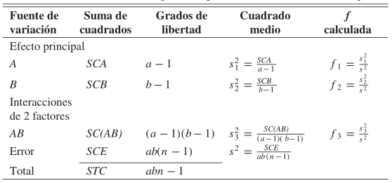

## Análisis factorial de varianza - ANOVA de dos factores

ANOVA de dos factores es una extensión de ANOVA de un factor. En el de un factor se etudia el efecto de un factor sobre la variale de decición, mientras que en el de dos factores, el efecto de dos favtores en la variable de decisión es simultáneamente estudiado. 

Un analisis de dos factores se diseña con el objetivo de comparar el efecto de multiples nivelEs de dos factores simultaneamentes en la variable de decisión. ANOVA de dos factores se realiza en dos situaciones: primero, cuando hay una observación por celda y, segundo, cuando hay mas de una observación por celda. En este ultimo caso, es necesario que las celdas tenga el mismo numero de observaciones. Usar ANOVA de dos factores con n observaciones permite verificar si hay interacción entre los dos factores. 

Ventajas:   
- permite estudiar el efecto de dos factores en la variable de decisión y el efecto de la interacción entre ellas.   
- Permite reducir la varianza del error ya que hay dos fuentes de variación posibles, y por lo tanto hace el diseño más eficiente.  

**Ventajas ANOVA de dos factores sobre ANOVA de un factor:**

- Permite estudiar dos factores al mismo tiempo. 
- Debido a que la variación puede explicarse por dos posibles causas, reduce el error de variabilidad. Es más eficiente. 
- Se puede probar la independencia de los factores siempre que haya mas de una observación por celda (el numero de observaciones por celda debe ser el mismo). En ANOVA de un factor, se debe tener un número dispar de observaciones en cada grupo. 
- Además de reducir el error de variabilidad, ANOVA de dos factores reduce el cálculo, ya que incluye varios ANOVA de un factor. 

## Principios 

Al diseñar experimentos, y con el objetivo de minimizar el error de varianza, se deben considerar tres principios: aletoriedad, replicación y control local. Estos permiten una mejor posición al concluir si la variación de la variable de decisión es debida un nivel identificable de un factor en particular.   

- **Aleatoriedad:** Las muestras de cada grupo son seleccionadas de forma aleatoria. Esto permite evita que las muestras estén sesgadas y que cada grupo sea lo más homogeneo posible.   

- **Replicación:** Estudiar el efecto de dos factores en más de un objeto de estudio. Permite estudiar la significancia de la interación entre los dos factores. Se hace imposible estudiar la interacción si sólo existe una observación en cada celda.  

- **Control local de variables:** Hacer los gruipos lo más homogeneos posibles de tal forma que la variación debida a uno o más causas posibles pueda ser aislada del error experimental. La aplicación del control local permite ayudarnos a reducir el error de variación y hacer el diseño más eficiente. Por ejemplo, si al estudiar la satisfacción en el empleo se realizara ANOVA I, y agruparamos a los empleados por edad, podríamos tener mayor variabilidad en los resultados debida por ejemplo a la infliuencia del género en la satisfacción. Por lo tanto, al considerar el género, haciendo los grupos mas hómogeneos, se disminuye esa variabilidad.   

# Terminología 

- **Factores:** Variables independientes a ser estudiadas. El efecto de dos factores es estudiado en cierta variable de decisión. Cada uno de los factores tiene dos o más niveles. Los grados de libertad (gl)se calculan de la siguiente forma:  

$$Sea\ N_{s}=número\ de\ niveles\ del\ factor\ s$$
 
$$gl_{s}=N_{s} - 1$$

- **Grupos de tratamiento:** Corresponde a todas las posibles combinaciones de niveles entre el factor A y factor B. 

$$Sea\ A_{i}\ el\ i-ésimo\ nivel\ del\ factor\ A,\ i=\{1,...,p\}$$

$$Sea\ B_{j}\ el\ j-ésimo\ nivel\ del\ factor\ B,\ j=\{1,...,q\}$$

$$El\ número\ de\ grupos\ de\ tratamientos\ distintos\ es:\ p*q$$

- **Efecto principal:** Corresponde al efecto de una variable independiente (o factor) en la variable independiente a partir de todos los niveles de la otra variable. Se ignora en este caso el efecto de la interacción. Sólo se usan las filas o las columnas, pero no ambas. Este análisis es similar al análisis de varianza de ANOVA de un factor. Cada una de las varianzas calculadas para analizar el efecto principal (filas y columnas) es como una "varianza entre". Los grados de libertad para el efecto principal se calculan de la siguiente forma: 

$$gl_{A}=(p-1)\ \ gl_{B}=(q-1)$$

- **Efecto de la interacción:** Corresponde al efecto conjunto de los dos factores sobre una variable dependiente. También puede ser definido como el efecto que un factor tiene sobre el otro factor. Los grados de libertad de la interacción es igual al producto de los grados de libertad de la interacción: 

$$gl_{(A \wedge B)} = gl_{A}*gl_{B} = (p-1)*(q-1)$$

- **Variación dentro grupos:** La variación dentro del grupo es la suma de cuadrados dentro de cada grupo de tratamiento. En el ANOVA de dos factores, cada grupo de tratamiento debe tener el mismo tamaño de muestra. La variancia dentro es igual a la variancia dentro deividida por sus grados de libertad. La varianza dentro del grupo es también llamada error. La variación dentro del grupo es frecuentemente llamada SSE.

# Modelo ANOVA de dos factores. 

## Condiciones del modelo: 
1. El tamaño de muestra en cada celda debe ser el mismo. 

## Supuestos del modelo

1. Las poblaciones desde donde se toman las muestras se distribuyen normalmente. 
2. Las muestras son independientes. 
3. La varianza de las poblaciones debe ser igual (homocedasticidad)
4. El tamaño de muestra debe ser igual en cada celda. 

## Formalización del modelo

     
Las observaciones de la celda (ij)-ésima constituyen una muestra aleatoria de tamaño n de una población que se supone tiene distribución normal con media $\mu_{ij}$ y varianza $\sigma^2$. Se supone que todas las $a*b$ poblaciones tienen la misma varianza $\sigma^2$.

Se definen los siguientes símbolos: 

$Y_{ij} =suma\ de\ las\ observaciones\ en\ la\ (ij)-ésima\ celda,$

$Y_{i..} =suma\ de\ las\ observaciones\ para\ el\ i-ésimo\ nivel\ factor\ A,$

$Y_{.j.} =suma\ de\ las\ observaciones\ para\ el\ j-ésimo\ nivel\ factor\ B,$

$Y_{...} = suma\ de\ las\ a*b*n\ observaciones,$

$\bar{y}_{ij} = media\ de\ las\ observaciones\ en\ la\ (ij)-ésima\ celda,$

$\bar{y}_{i..} = media\ de\ las\ observaciones\ para\ el\ i-ésimo\ nivel\ factor\ A,$

$\bar{y}_{.j.} = media\ de\ las\ observaciones\ para\ el\ j-ésimo\ nivel\ factor\ B,$

$\bar{y}_{...} = media\ de\ todas\ las\ a*b*n\ observaciones.$

Las poblaciones, de las que se toman las n observaciones independientes con distrubucion idéntica, son combinaciones de los factores. Además, se supondrá siempre quede cada combinación de factores se toma un número igual (n) de observaciones.

# Desarrllo de hipótesis

Podemos escribir cada observación de la tabla como: 

$$y_{ijk} = \mu_{ij} + \epsilon_{ijk},$$

donde $\epsilon_{ijk}$ mide las desviaciones de los valores de $y_{ijk}$ observados en la $(ji)$-$ésima$ celda respecto de la media de la población dada por $\mu_{ij}.$

Si consideramos $(\alpha\beta)_{ij}$ como el efecto de la interación del $i$-$ésimo$ nivel del factor $A$ y el $j$-$ésimo$ nivel del factor B, $\alpha_{i}$ el efecto del $i$-$ésimo$ nivel del factor $A$, $\beta{j}$ el efecto del $j$-$ésimo$ nivel del factor $B$, y $\mu$ la media conjunta, escribamos: 

$$\mu_{ij}=\mu+\alpha_{i}+\beta{j}+(\alpha\beta)_{ij},$$

y, por lo tanto, 

$$y_{ijk}=\mu+\alpha_{i}+\beta{j}+(\alpha\beta)_{ij}+\epsilon_{ijk},$$

$$\sum_{i=1}^a\alpha_{i}=0,\ \ \sum_{j=1}^b\beta_{j}=0,\ \ \sum_{i=1}^a (\alpha\beta)_{ij}=0,\ \ \sum_{j=1}^b (\alpha\beta)_{ij}=0.$$

## Hipótesis a probar:

<ol>
<li>
$H_{0}':\ \alpha_{1} = \alpha_{2} = \dots = \alpha_{a} = 0$, 
$H_{1}': Al\ menos\ una\ de\ las\ \alpha_{i} no\ es\ igual a\ 0.$
</li>
<li>
$H_{0}'':\ \beta{1} = \beta{2} = \dots = \beta{b} = 0$, 
$H_{1}'': Al\ menos\ una\ de\ las\ \beta{i} no\ es\ igual a\ 0.$
</li>
<li>
$H_{0}''':\ \alpha\beta{11} = \alpha\beta{12} = \dots = \alpha\beta{ab} = 0$, 
$H_{1}''': Al\ menos\ una\ de\ las\ (\alpha\beta{ij}) no\ es\ igual a\ 0.$
</li>  
 
Las pruebas de hipótesis anteriores se basarán en la comparación de estimados independientes de $\sigma^{2}$, obtenidos al separar la suma de cuadrados total de los datos en cuatro componentes.

### Identidad de la suma de cuadrados. 

$$\sum_{i=1}^a{\sum_{j=1}^b{\sum_{k=1}^n}} (y_{ijk}-\bar{y}_{\dots})^2 = bn\sum_{i=1}^a (\bar{y}_{i..} - \bar{y}_{\dots})^2 + an\sum_{j=1}^b (\bar{y}_{.j.} - \bar{y}_{\dots})^2 + n\sum_{i=1}^a{\sum_{j=1}^b}{(\bar{y}_{ij.} -\bar{y}_{i..} - \bar{y}_{.j.} + \bar{y}_{\dots})^2} + \sum_{i=1}^a{\sum_{j=1}^b{\sum_{k=1}^n}} {(y_{ijk}-\bar{y}_{ij})^2}$$

Lo anterior podemos expresarlo simbólicamente como: 

$$SCT = SCA + SCB SC(AB) + SCE,$$

donde $SCA$ y $SCB$ corresponden a la suma de cuadrados para los efectos principales $A$ y $B$ o filas y columnas respectivamente según la tabla anterior, $SC(AB)$ recibe el nombre de suma de cuadrados de la interacción para $A$ y $B$, y $SCE$ es la suma de los cuadrados del error. 

**Grados de libertad** 

$$abn -1 = (a-1) + (b-1) + (a-1)(b-1)+ab(n-1)$$

Si dividimos cada una de las sumas de los cuadrados en el lado derecho de la identidad de la suma de cuadrados entre su núimero correspondiente de grados de libertad, obtendremos los cuatro estadísticos: 

$$S_{1}^{2}=\frac{SCA}{a-1},\ \ \ S_{2}^{2}=\frac{SCB}{b-1},\ \ \ S_{3}^{2}=\frac{SC(AB)}{(a-1)(b-1)},\ \ \ S^{2}=\frac{SCE}{ab(n-1)}$$

Todos estos estimadores de la varianza son estimados independiendes de $\sigma^{2}$, siempre que no haya efectos $\alpha_{i}$, $\beta{j}$ ni, por supuesto, $(\alpha\beta)_{ij}$. Si las sumas de los cuadrados se interpretan como funciones de las variables aleatorias independientes $y_{111}, y{112},\dots,y_{abn}$, no es difícil comprobar que: 

$$E(S_{1}^{2})=E[\frac{SCA}{a-1}] = \sigma^2 +\frac{nb}{a-1}\sum_{i=1}^a\alpha_{i}^{2},$$
  
$$E(S_{2}^{2})=E[\frac{SCB}{b-1}] = \sigma^2 +\frac{na}{b-1}\sum_{j=1}^a\beta_{j}^{2},$$
  
$$E(S_{3}^{2})=E[\frac{SC(AB)}{(a-1)(b-1)}] = \sigma^2 + \frac{n}{(a-1)(b-1)} \sum_{i=1}^a{\sum_{j=1}^b}{(\alpha\beta)_{ij}},$$

$$E[S^{2}]=E[\frac{SCE}{ab(n-1)}] = \sigma^2$$

De lo anterior se observa que los cuatro estimadores son no sesgados cuando $H_{0}', H_{0}'' y H_{0}'''$ son verdaderas.

### Comprobación de hipótesis nula

- Prueba F para Factor A

$$f_{1}=\frac{S_{1}^{2}}{S^{2}},$$

que es un valor de la variable aleatoria $F_{1}$~$F_{((a-1),(ab(n-1))}$ cuando $H_{0}'$ es verdadera. Se rechaza la hipótesis nula al nivel de significncia $\alpha$ cuando $f_{1} > f_{\alpha}[a-1,ab(n-1)]$.

- Prueba F para Factor B

$$f_{2}=\frac{S_{2}^{2}}{S^{2}},$$

que es un valor de la variable aleatoria $F_{2}$~$F_{((b-1),(ab(n-1))}$ cuando $H_{0}''$ es verdadera. Se rechaza la hipótesis nula al nivel de significncia $\alpha$ cuando $f_{2} > f_{\alpha}[b-1,ab(n-1)]$.

- Prueba F para interacción

$$f_{3}=\frac{S_{3}^{2}}{S^{2}},$$

que es un valor de la variable aleatoria $F_{3}$~$F_{((a-1)(b-1),(ab(n-1))}$ cuando $H_{0}'''$ es verdadera. Se rechaza la hipótesis nula al nivel de significncia $\alpha$ cuando $f_{3} > f_{\alpha}[(a-1)(b-1),ab(n-1)]$.

  
  

# Ejemplo

# Referencias

- **Data Analysis in Management With SPSS Software**. J.P Verma, Chapter 8, DOI:10.1007/978-81-322-0786-3_8, (C) Springer India 2013
- **Probabilidad y estadística para ingeniería y ciencias**. Ronald E Walpole, R. H. Myers, S. L. Myers, K. Ye, 9na ED, PEARSONS EDUCACIÓN, México, 2012.  
- [ANOVA in R: A step-by-step guide](https://www.scribbr.com/statistics/anova-in-r/)  
- [aov documentation](https://www.rdocumentation.org/packages/stats/versions/3.6.2/topics/aov)