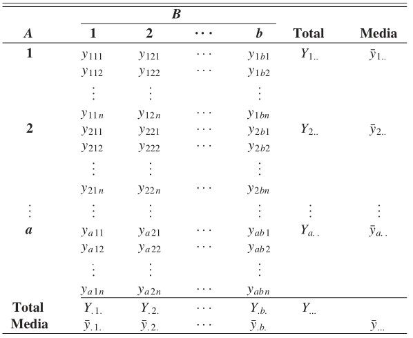

Analisi factorial de varianza. ANOVA de dos factores.
========================================================
author: Juan Pablo Saavedra Guerin
date: 28082020
autosize: true

Definición inicial
========================================================

ANOVA de dos factores se utiliza para estudiar el efecto que tienen dos variables independientes sobre una variable dependiente.

Ventajas
========================================================
 
- permite estudiar el efecto de dos factores en la variable de decisión y el efecto de la interacción entre ellas.   
- Permite reducir la varianza del error ya que hay dos fuentes de variación posibles, y por lo tanto hace el diseño más eficiente.  

**Ventajas sobre ANOVA de un factor:**

- Debido a que la variación puede explicarse por dos posibles causas, reduce el error de variabilidad. Es más eficiente. 
- Se puede probar la independencia de los factores siempre que haya mas de una observación por celda (el numero de observaciones por celda debe ser el mismo). 
- Reduce el cálculo, ya que incluye varios ANOVA de un factor. 

Modelo
========================================================

Referencias
========================================================

- **Data Analysis in Management With SPSS Software**. J.P Verma, DOI:10.1007/978-81-322-0786-3_8, (C) Springer India 2013
- **Probabilidad y estadística para ingeniería y ciencias**. Ronald E Walpole, R. H. Myers, S. L. Myers, K. Ye, 9na ED, PEARSONS EDUCACIÓN, México, 2012.  
- [ANOVA in R: A step-by-step guide](https://www.scribbr.com/statistics/anova-in-r/)  
- [aov documentation](https://www.rdocumentation.org/packages/stats/versions/3.6.2/topics/aov)

El desarrollo completo del código utilizado en esta presentación así como la base de datos referenciada se puede encontrar en [**este repositorio.**](jpsaavedraguerin/metodos-cuantitativos)

LICENCIA
=======================================================

Licenciado bajo [MIT Licence](LICENCE)

